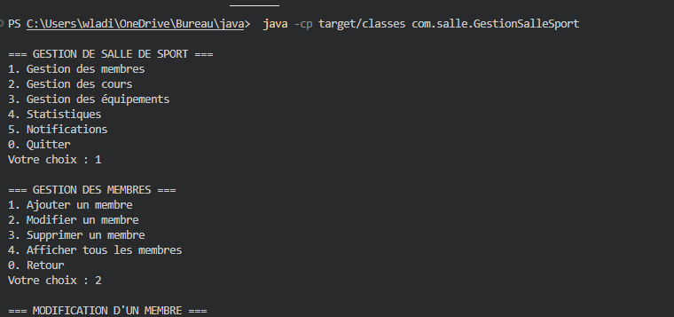

# Gestion de Salle de Sport

Application Java de gestion de salle de sport en ligne de commande (CLI).

## 📋 Description

Cette application permet de gérer :
- Les membres de la salle
- Les cours et leurs participants
- Les équipements (machines et accessoires)
- Les abonnements

## 🛠️ Technologies utilisées

- Java 11
- Maven
- Jackson (pour la persistance JSON)

## 📦 Structure du projet

```
src/
├── main/
│   └── java/
│       └── com/
│           └── salle/
│               ├── model/
│               │   ├── Personne.java (abstraite)
│               │   ├── Membre.java
│               │   ├── Entraineur.java
│               │   ├── Service.java
│               │   ├── Cours.java
│               │   ├── Abonnement.java
│               │   ├── Equipement.java
│               │   ├── Machine.java
│               │   └── Accessoire.java
│               ├── interfaces/
│               │   └── IGestionStock.java
│               └── GestionSalleSport.java
└── test/
    └── java/
        └── com/
            └── salle/
                └── tests/
```

## 🚀 Installation

1. Cloner le dépôt :
```bash
git clone https://github.com/wladilaw/gestion-salle-sport.git
```

2. Compiler le projet avec Maven :
```bash
mvn clean install
```

3. Exécuter l'application :
```bash
 java -cp target/classes com.salle.GestionSalleSport

```

## 💻 Fonctionnalités

### Gestion des membres
- Ajout d'un nouveau membre
- Modification des informations
- Suppression d'un compte
- Consultation des profils

### Gestion des cours
- Création de nouveaux cours
- Attribution des entraîneurs
- Gestion des participants
- Consultation du planning

### Gestion des équipements
- Ajout de machines et accessoires
- Suivi de l'état
- Gestion des réservations
- Inventaire

## 📝 UML

Le projet inclut les diagrammes UML suivants :
- Diagramme de classes
- Diagramme de cas d'utilisation
- Diagrammes de séquence
- Diagramme d'état
- Fait avec une ia et des aides sur youtubes pour comprendre 

## 👥 Auteurs

- Alexis Derveaux (yxmmy)
- Jules Machay (wladislawpl)
- jeremie moukala (denzel)